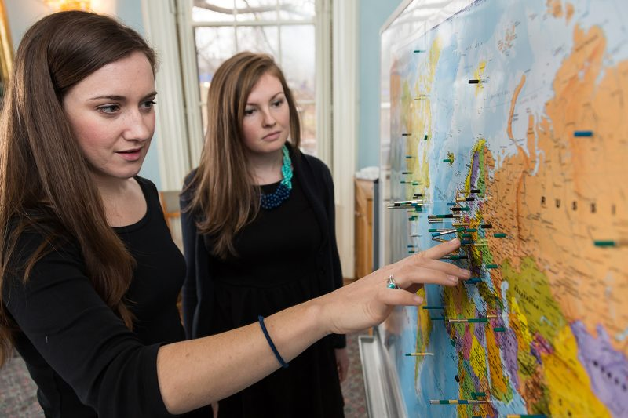

- __Name:__ Kat Devlin

- __Now:__ Research Associate, Pew Research Center Global Attitudes Project

- __Education:__ MA, Yale University, Global Affairs -- Concentration in Quantitative Research Methods (2017); BA, Villanova University, Political Science -- Minor in Chinese Studies (2011)

- __Past Experience:__ Teaching Fellow - Applied Quantitative Analysis, Yale University; Consultant, Talent, Inc.; Research Analyst, Pew Research Center; Fulbright Grantee (Malaysia), U.S. Fulbright Program; Consulting Intern, Luntz Global LLC 

A native of South Jersey, I enjoy books, vegetarian cooking and the perpetual heartache of being a Philadelphia sports fan.

At Yale, I concentrated in quanatitative research methods/applied statistics. This included working in R, Stata, Excel and some Python. I also studied Chinese and looked at maps (below, center).

